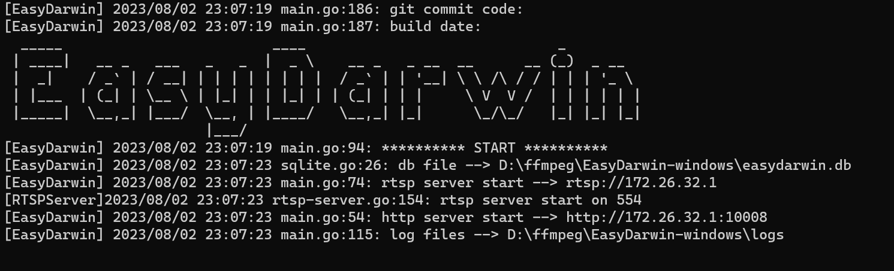
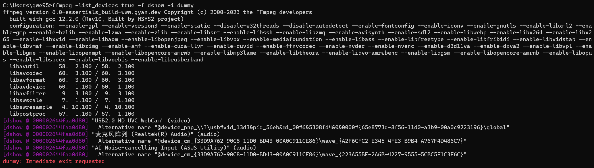
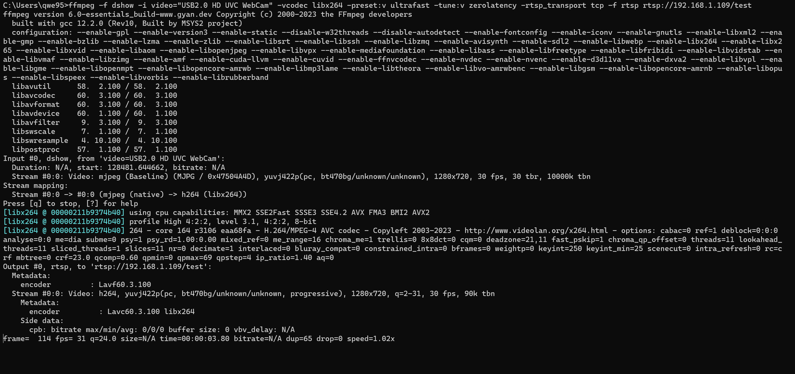
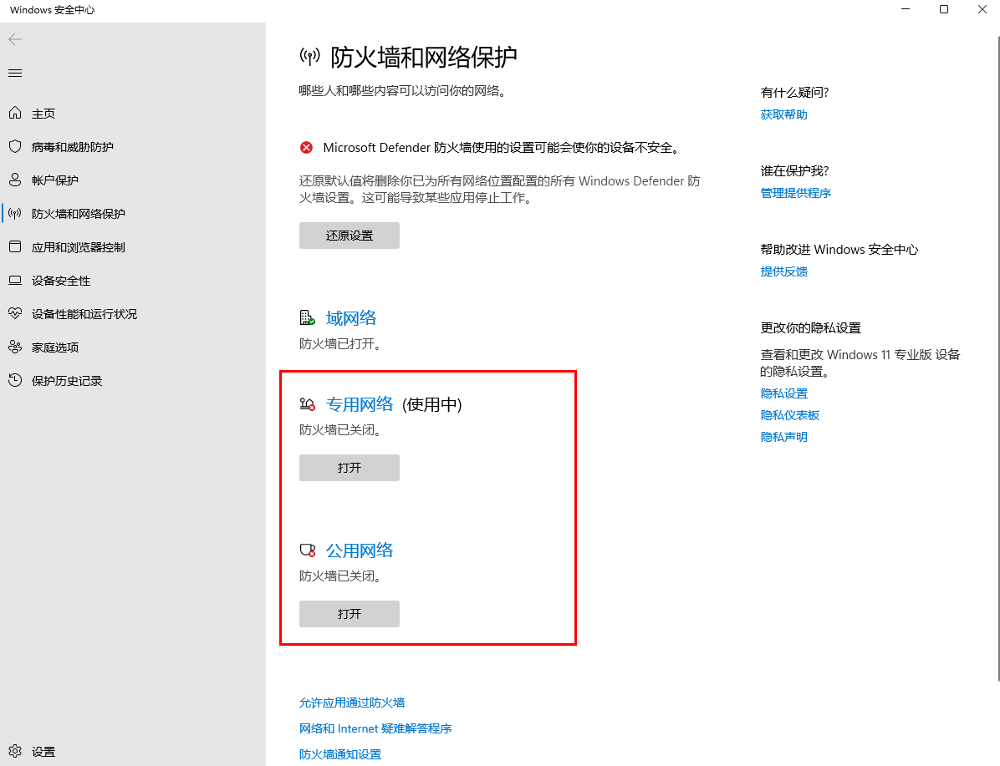
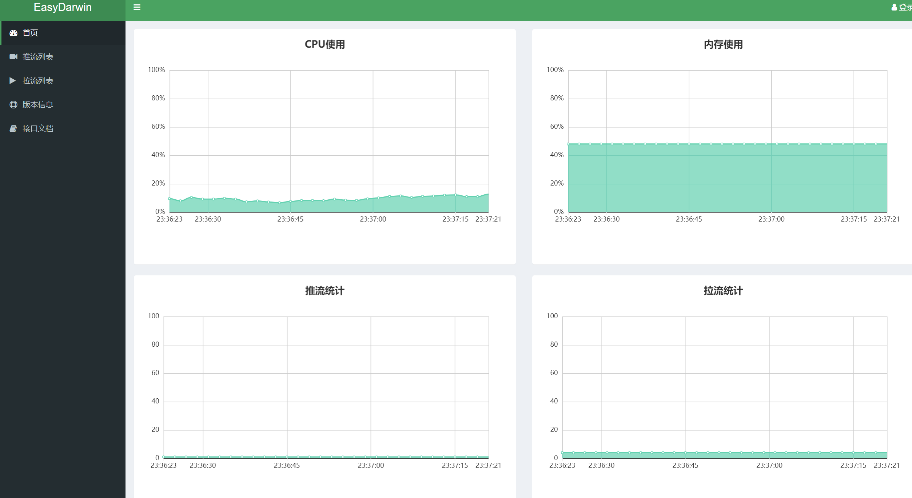
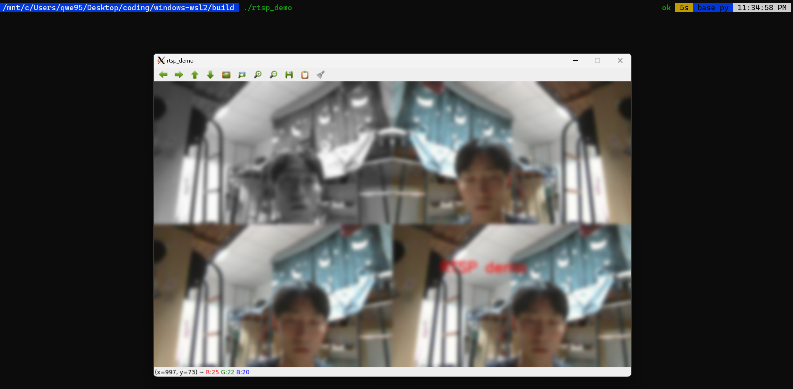
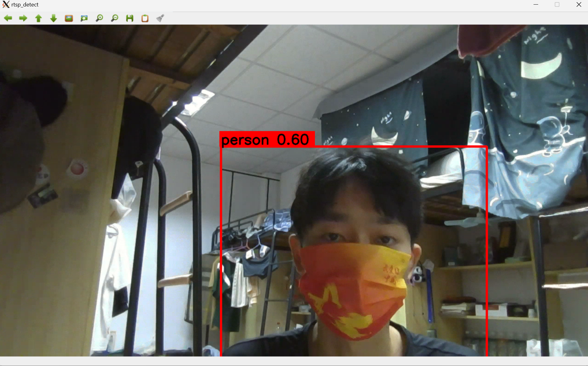

# Project

## 1. WSL2通过OpenCV调用并展示本机摄像头的RTSP视频流

&emsp;&emsp;在WSL2环境下，摄像头通常不能直接访问。这是因为WSL2本质上是一个虚拟机环境，它与主机系统是隔离的。虚拟机环境中的操作系统无法直接访问主机系统的硬件。非要调用摄像头，估计要重新修改wsl2的源码自行编译。。。

&emsp;&emsp;总之，由于WSL2环境与主机系统隔离，访问本机摄像头是有限的。但是，您可以通过使用第三方库或网络摄像头，或在本地环境中进行调试和测试，来解决这个问题。

### 步骤
1.  安装 FFmpeg(win&wsl2)
2.  安装 OpenCV(wsl2)
3.  下载解压 EasyDarwin

Easydarwin是国内团队开发的开源流媒体框架。它是基于Go语言研发，从2012年12月创建并发展至今，从原有的单服务的流媒体服务器形式，扩展成现在的云平台架构开源项目，属于高性能开源RTSP流媒体服务器，在Github上受到广大欢迎。

特点：RTSP推模式转发、RTSP拉模式转发、录像、检索、回放、关键帧缓存、秒开画面、RESTful接口、WEB后台管理、分布式负载均衡。

<div align=middle></div>

*PS:EasyDarwin默认554端口+id，占用的话需先杀死再启用*

4. 查看本机摄像头设备
```
ffmpeg -list_devices true -f dshow -i dummy
```
<div align=middle></div>

5. 开始推流
```
ffmpeg -f dshow -i video="USB2.0 HD UVC WebCam" -vcodec libx264 -preset:v ultrafast -tune:v zerolatency -rtsp_transport tcp -f rtsp rtsp://192.168.1.109/test
```
- -f dshow -i video="摄像头名称" 指定从本地摄像头中读取视频流。将“摄像头名称”替换为您的摄像头名称，例如“USB2.0 HD UVC WebCam”。
- -vcodec libx264 指定使用 x264 编码器进行视频编码。
- -preset ultrafast 设置编码速度。这里使用的是最快的编码速度，但可能会导致视频质量下降。
- -tune zerolatency 设置编码器以实现零延迟。
- -f rtsp 指定输出流的格式为 RTSP。
- rtsp://<IP地址>/<路径> 指定 RTSP 流的目标地址。请将 <IP地址> 替换为 Windows 本机 IP 地址，将 <路径> 替换为您想要为流指定的路径。

<div align=middle></div>

6. 开放本机防火墙（可选）
因为我们要在 WSL2 里访问本机的 RTSP 视频流，所以需要打开本机的防火墙，如下图
<div align=middle></div>

7. wsl2用 OpenCV 接收视频流
```
cmake .
make
./build/rtsp_demo
```

8. 通过远程gui展示
可通过Easydarwin监管推流和拉流，然后通过vnc，XLaunch(本人使用)等完成wsl2的可视化(模拟4路+高斯模糊)：
<div align=middle></div>
<div align=middle></div>

## 2. 在步骤1的基础上完成wsl2对视频流进行tensorrt模型加速推理展示

可通过test/test_yolo_detect.cpp完成wsl2对视频流进行tensorrt模型加速推理展示(通过队列存储维护图像推流和拉流顺序)：
<div align=middle></div>
